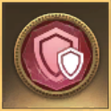

# GoT:WiC Badge Bot for Discord

## Commands

- `!badges help` - usage instructions
- `!badges #` - replies with the optimal badge configuration based on the player having # common (grey) badges

## Installation

- [Click here](https://discord.com/oauth2/authorize?client_id=787512971164647474&scope=bot&permissions=19456) to add this bot to your [Discord](https://discord.com).
- Add the Badges Bot to any channel you would like
- Badges Bot also responds to DMs

## ...but why?

> Ok, see... originally I wrote a small program in C# to generate a CSV which would allow you to lookup your optimal badge configuration. I'm lazy AF though, and didn't want to have to go scroll to the right row in the spreadsheet. (Don't judge!) I also wanted to learn how to write a Discord bot, so here we are. 
>
> Since I already had the CSV generated, I figured there was no point in running the calculations on the fly, so the bot reads in the csv when it starts & just looks up the answer. It does dynamically figure out how many badges until the next upgrade. I suppose I could have included that in the CSV too and saved some compute cycles. Oh well... what's done is done.
